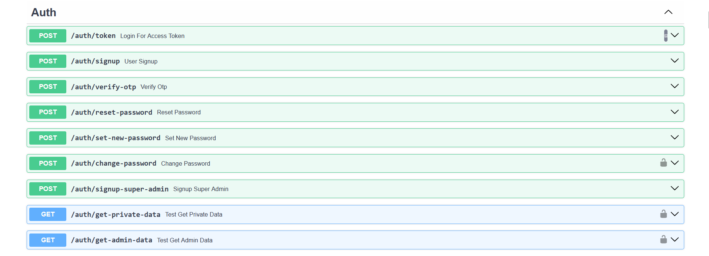

# Pathok Point Backend


Welcome to the backend repository of Pathok Point, an innovative ecommerce platform specifically designed for book enthusiasts. This repository houses the robust backend infrastructure developed using FastAPI, a high-performance asynchronous web framework for building APIs with Python.

## Installation

To set up the project and install its dependencies, ensure you have Poetry installed. Then execute the following command:

```bash
poetry install
```

## Features

### User Management
1. Easy sign-up with email verification using a one-time password (OTP).
2. Simple profile management for users.

### Books Management
1. Effortless ordering of books, both new and used.
2. Advanced search and filtering options for finding books.
3. Convenient bulk uploading and CSV import/export for managing book inventory.

### Author & Publisher Management
1. Users can follow favorite authors for updates.
2. Admins can set discounts for author birthdays.
3. Admin control for setting publisher book discounts.

### Category & Tag Management
1. Browse books by categories.
2. Grouping of similar products using tags for easier searching.

### Coupon Management
1. Apply coupons to all books or specific conditions.
2. Target coupons for authors, publishers, categories, tags, or users.
3. Set discounts in fixed amounts, percentages, or on shipping.
4. Configure minimum spend and maximum discount limits.

### Order Management
1. Secure order placement with upfront shipping fee payment.
2. Admins can edit orders as needed.
3. Flexible payment options for changing order amounts.

### Reviews & Feedback
1. Authenticated users can leave book reviews.
2. Feedback options for product, delivery, and website experience.
3. Admin approval required for reviews.

### Shipping & Payment
1. Multiple shipping options based on customer preferences.
2. Secure payment processing and refunds through integrated gateways.

### Technical Details

1. **FastAPI**: Chosen for its high performance and asynchronous capabilities.
2. **SQLAlchemy**: Used for reliable database operations.
3. **PostgreSQL + asyncpg**: Backend database setup for optimal performance.
4. **Redis**: Employed for efficient data caching.
5. **Pydantic**: Ensures data validation and integrity.
6. **Swagger UI**: Comprehensive API documentation.
7. **Cloudflare**: Selected for image storage reliability.
8. **Python Logging**: Implemented for logging capabilities.
9. **JWT**: Token-based authentication for enhanced security.
10. **FastAPI-Mail**: Integrated for easy email communication.
11. **FastAPI Filter**: Facilitates sorting and filtering of data.
12. **Pillow**: Used for image compression.
13. **Pytest**: Employed for unit testing.
14. **Alembic**: Used for database migrations.
15. **Faker**: Facilitates database seeding.
16. **FastAPI Analytics**: Provides insights into traffic analysis.


## Screenshots

Here is a screenshot of our Swagger UI documentation:





## License

All rights reserved by Pathok Point. This project is proprietary software. No part of it can be copied, distributed, or used without explicit permission from Pathok Point.

